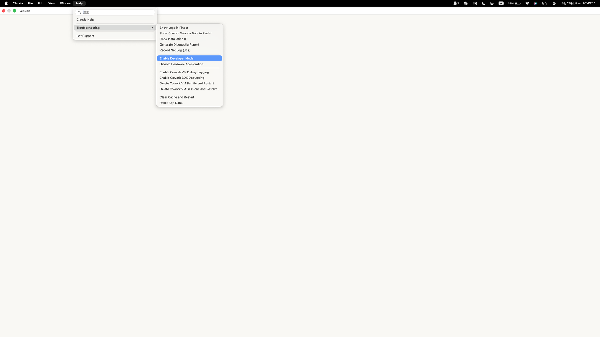
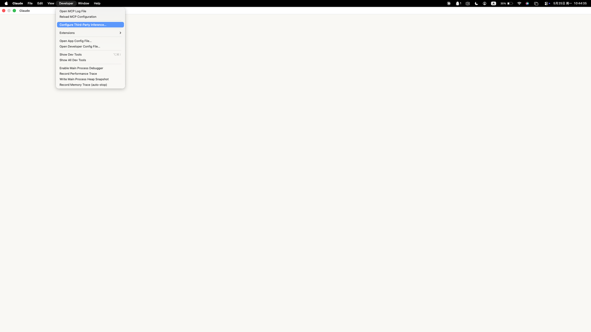
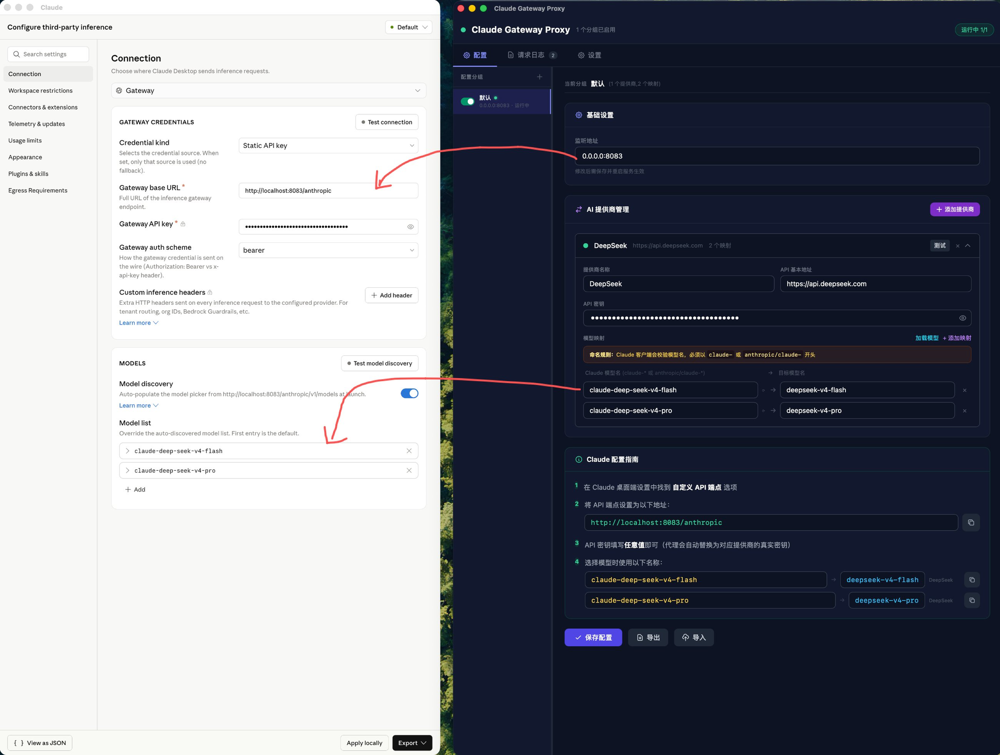

# Claude Gateway Proxy

一个基于 Rust + Tauri 2 构建的桌面应用，作为 Claude Desktop 的多 AI 提供商反向代理网关。让 Claude 桌面客户端可以透明地使用 DeepSeek、OpenAI 等第三方大模型。

## 问题背景

Claude 桌面端内置了模型格式校验机制，界面层只识别以下前缀的模型名：

- `claude-` 开头（如 `claude-sonnet-4-5`）
- `anthropic/claude-` 开头（如 `anthropic/claude-sonnet-4-5`）

如果直接填写 `deepseek-v4-pro`、`gpt-4o` 等第三方原生模型名，客户端会触发红色格式警告，无法通过基础校验。

## 解决方案

本代理服务在本地启动一个 HTTP 反向代理，通过模型名映射解决兼容性问题：

```
┌─────────────────┐      claude-sonnet-4-5      ┌──────────────────┐      deepseek-v4-pro      ┌─────────────────┐
│  Claude Desktop  │ ──────────────────────────▶ │  AI Gateway Proxy │ ────────────────────────▶ │  DeepSeek API   │
│                  │ ◀────────────────────────── │                   │ ◀──────────────────────── │                 │
└─────────────────┘     流式响应（透传）          └──────────────────┘     流式响应（透传）         └─────────────────┘
```

1. Claude Desktop 发出请求，模型名为 `claude-sonnet-4-5`
2. 代理拦截请求，将模型名替换为 `deepseek-v4-pro`
3. 代理将请求转发到 DeepSeek API，并替换 API 密钥
4. 响应流式透传回 Claude Desktop

## 功能特性

- **配置分组** — 支持创建多个独立配置分组，每组有自己的监听地址和提供商配置
- **多代理并行** — 可手动开启/关闭每个分组的代理，多个分组可同时运行在不同端口
- **多 AI 提供商** — 每组可配置多个提供商（DeepSeek、OpenAI 等），各自独立的 API 密钥、基础地址和模型映射
- **可拖拽分栏** — 左侧分组列表 + 右侧配置详情，分隔条可自由拖拽调整宽度
- **Tab 切换** — 配置面板与请求日志分 Tab 展示，一键切换
- **模型名映射** — 灵活配置 Claude 模型名到目标模型名的映射关系
- **流式响应** — SSE 流式响应完整透传
- **日志分组标识** — 代理日志自动带 `[分组名]` 前缀，多代理并行时清晰区分来源
- **macOS 系统托盘** — 快速启停全部代理，点击托盘图标显示窗口
- **实时日志** — 彩色标记的代理转发日志，自动滚动
- **连接测试** — 一键测试各提供商的 API 连通性
- **配置持久化** — JSON 配置文件保存在 `~/.ai-gateway-proxy/config.json`，旧格式自动迁移

## 技术栈

| 层 | 技术 |
|---|------|
| 桌面框架 | Tauri 2 |
| 后端 | Rust (hyper, reqwest, tokio, serde) |
| 前端 | React 18 + TypeScript + Tailwind CSS |
| 构建 | Vite + Cargo |
| 包管理 | Bun |

## 环境要求

- [Bun](https://bun.sh) 1.0+（推荐）或 Node.js 18+
- Rust 工具链（rustc 1.75+、cargo）
- macOS 10.15+ / Windows 10+ / Linux（Tauri 2 支持的平台）

安装 Rust：

```bash
curl --proto '=https' --tlsv1.2 -sSf https://sh.rustup.rs | sh
```

安装 Bun：

```bash
curl -fsSL https://bun.sh/install | bash
```

## 快速开始

### 1. 克隆项目

```bash
cd ClaudeDesktopGatewayProxy
```

### 2. 启动开发模式

```bash
# macOS / Linux
./start.sh

# Windows
start.bat
```

启动脚本会自动检查端口冲突（Vite 1420、代理 8082），如果端口被占用会提示你选择：终止占用进程 / 忽略继续 / 退出。

### 3. 编译打包

一键脚本（安装依赖、生成图标、编译 Rust + 前端）：

```bash
./build.sh
```

或手动分步执行：

```bash
bun install          # 安装前端依赖
bun run tauri dev    # 启动开发模式
bun run tauri build  # 生产构建
```

`tauri dev` 会同时启动 Vite 前端开发服务器和 Tauri 桌面窗口。首次启动时 Cargo 会自动下载并编译 Rust 依赖，可能需要几分钟。

构建产物位于 `src-tauri/target/release/bundle/`。

## 使用指南

### 界面布局

应用采用左右分栏 + Tab 切换布局：

- **配置 Tab** — 左侧为配置分组列表，右侧为当前选中分组的完整配置
- **请求日志 Tab** — 全屏日志查看器，实时显示所有分组的代理请求记录
- 左右面板间分隔条可拖拽调节宽度

### 配置分组

每个分组是一套独立的代理配置（独立的监听地址和提供商列表），可手动开启/关闭代理。

1. 左侧面板点击 **+** 创建新分组，双击分组名可重命名
2. 点击分组主体切换到该分组进行编辑
3. 点击分组前的**滑动开关**控制该分组的代理是否启用
4. 开关打开 + 保存配置后，后台自动为该分组启动代理
5. 多个分组可同时开启，各跑各的端口互不干扰

分组状态指示：
- 🔘 ON + 绿点闪烁 = 代理运行中
- 🔘 ON + "等待保存" = 已开启但未保存
- 🔘 OFF + "已关闭" = 该分组代理未激活

### 配置 AI 提供商

在右侧配置面板中：

1. **基础设置** — 修改当前分组的代理监听地址（如 `0.0.0.0:8082`）
2. **添加提供商** — 点击"添加提供商"，展开后填写：
   - 提供商名称（如 DeepSeek、OpenAI）
   - API 基本地址（如 `https://api.deepseek.com`）
   - API 密钥
   - 模型映射表
3. **模型映射** — 每一行定义一条映射：
   - 左侧：Claude 格式的别名模型名（必须以 `claude-` 或 `anthropic/claude-` 开头）
   - 右侧：提供商的实际模型名
4. **测试连接** — 点击提供商标题栏的"测试"按钮验证 API 连通性
5. **保存配置** — 点击底部"保存配置"，所有开启的分组自动启动代理

### 配置 Claude Desktop

首先需要开启 Claude Desktop 的开发者模式，进入 **Help → Troubleshooting → Enable Developer Mode**：



然后在 **Developer → Configure Third-Party Inference...** 中配置第三方推理接入：



1. 在 Claude 桌面端设置中找到**自定义 API 端点**选项
2. 将 API 端点设置为代理地址（界面指南面板会显示当前地址，如 `http://localhost:8082/anthropic`）
3. API 密钥填写任意值即可（代理会自动替换为对应提供商的真实密钥）
4. 选择模型时使用你在映射表中配置的 Claude 格式名称

下图展示了 Claude Desktop（左）与本代理（右）字段的对应关系：左侧 Connection 面板的 **Gateway base URL** 对应右侧的**监听地址**，**Model list** 中的别名对应右侧**模型映射**中的 Claude 模型名。



### 系统托盘

- 点击托盘图标：显示/隐藏主窗口
- 右键菜单：
  - **启动代理 / 停止代理**：切换代理服务
  - **显示窗口**：打开配置界面
  - **退出**：停止代理并退出应用

## 配置格式

配置文件保存在 `~/.ai-gateway-proxy/config.json`：

```json
{
  "groups": [
    {
      "id": "default",
      "name": "默认",
      "listen_addr": "0.0.0.0:8082",
      "enabled": false,
      "providers": [
        {
          "name": "DeepSeek",
          "api_key": "sk-your-deepseek-api-key",
          "base_url": "https://api.deepseek.com",
          "enabled": true,
          "model_mappings": [
            {
              "alias_model": "claude-sonnet-4-5",
              "target_model": "deepseek-v4-pro"
            }
          ]
        }
      ]
    },
    {
      "id": "g2",
      "name": "本地模型",
      "listen_addr": "0.0.0.0:8083",
      "enabled": true,
      "providers": [
        {
          "name": "Ollama",
          "api_key": "",
          "base_url": "http://localhost:11434/v1",
          "enabled": true,
          "model_mappings": [
            {
              "alias_model": "claude-3-5-haiku-20241022",
              "target_model": "qwen2.5:7b"
            }
          ]
        }
      ]
    }
  ],
  "active_group": "default"
}
```

### 字段说明

| 字段 | 类型 | 说明 |
|------|------|------|
| `groups` | array | 配置分组列表，每个分组是一套独立的代理配置 |
| `groups[].id` | string | 分组唯一标识 |
| `groups[].name` | string | 分组显示名称 |
| `groups[].listen_addr` | string | 该分组的代理监听地址 |
| `groups[].enabled` | boolean | 是否启用该分组的代理 |
| `groups[].providers[].name` | string | 提供商显示名称 |
| `groups[].providers[].api_key` | string | 提供商的 API 密钥 |
| `groups[].providers[].base_url` | string | API 基础地址 |
| `groups[].providers[].enabled` | boolean | 是否启用该提供商 |
| `groups[].providers[].model_mappings[].alias_model` | string | Claude 格式别名 |
| `groups[].providers[].model_mappings[].target_model` | string | 提供商实际模型名 |
| `active_group` | string | 当前激活的分组 ID |

## 项目结构

```
ClaudeDesktopGatewayProxy/
├── src-tauri/                        # Rust 后端
│   ├── Cargo.toml                    # Rust 依赖声明
│   ├── tauri.conf.json               # Tauri 窗口、打包、安全配置
│   ├── build.rs                      # Tauri 构建脚本
│   └── src/
│       ├── main.rs                   # Rust 入口点
│       ├── lib.rs                    # Tauri App 构建、全局状态、多代理管理
│       ├── config.rs                 # 配置管理器（分组、JSON 读写、旧格式迁移）
│       ├── commands.rs               # Tauri IPC 命令（分组 CRUD、多代理启停、日志）
│       ├── tray.rs                   # macOS 系统托盘（程序化图标生成、菜单事件）
│       └── proxy/
│           ├── mod.rs                # ProxyServer — 基于 hyper 的可启停 HTTP 代理
│           └── handler.rs            # 请求处理 — JSON 模型名替换、reqwest 转发、连接测试
├── src/                              # React 前端
│   ├── main.tsx                      # React 入口
│   ├── App.tsx                       # 根组件 — 分组管理、Tab 切换、IPC 调用
│   ├── types.ts                      # TypeScript 类型定义
│   ├── index.css                     # Tailwind + 全局样式
│   └── components/
│       ├── Header.tsx                # 顶栏（全局启停、运行分组数、代理地址）
│       ├── BasicSettings.tsx         # 监听地址配置
│       ├── ProviderList.tsx          # 多提供商管理（可折叠、表单验证、测试连接）
│       ├── GuidePanel.tsx            # Claude Desktop 配置步骤指引
│       ├── LogViewer.tsx             # 实时日志（彩色标记、自动滚动、清空）
│       ├── ToastContainer.tsx        # 浮动通知组件
│       └── SplitPane.tsx             # 可拖拽分栏（窗口自适应、比例记忆）
├── start.sh                          # 开发启动脚本 (macOS/Linux)
├── start.bat                         # 开发启动脚本 (Windows)
├── build.sh                          # 编译打包脚本
├── index.html                        # Vite HTML 入口
├── package.json                      # 前端依赖（React、Tailwind、Vite、Tauri API）
├── vite.config.ts                    # Vite 构建配置
├── tsconfig.json                     # TypeScript 配置
└── tailwind.config.js                # Tailwind CSS 配置
```

## 工作原理

1. **接收请求** — 代理监听本地端口（默认 8082），接收 Claude Desktop 发来的 HTTP 请求
2. **解析模型名** — 从请求 JSON body 中提取 `model` 字段
3. **匹配提供商** — 遍历所有已启用的提供商，查找匹配的 `alias_model`
4. **重写请求体** — 将 `model` 替换为对应提供商的 `target_model`
5. **替换认证** — 将 `Authorization` 头替换为提供商的真实 API 密钥
6. **转发请求** — 将修改后的请求发送到提供商的 API 地址
7. **流式透传** — 将 API 响应完整转发回 Claude Desktop，支持 SSE 流式传输

## 故障排查

### 代理无法启动

- 检查监听端口是否被占用：`lsof -i :8082`
- 确认该分组开关已打开（左侧分组列表中的滑动开关）并已保存
- 确认至少有一个提供商已配置 API 密钥并启用
- 查看请求日志 Tab 中的错误信息，日志格式为 `[分组名] 错误描述`

### API 请求返回错误

- 在提供商卡片中点击"测试"按钮验证 API 密钥是否有效
- 检查 API 密钥是否有足够的配额
- 确认模型映射中的 `target_model` 在该提供商上可用
- 查看请求日志中的具体错误状态码

### 模型名不被 Claude Desktop 识别

- 确保 `alias_model` 以 `claude-` 或 `anthropic/claude-` 开头
- 参考配置指南面板中显示的可用模型名列表
- 保存配置后确认代理已重启

### Claude Desktop 连接不上代理

- 确认代理状态显示"运行中"
- 检查 Claude Desktop 中配置的 API 端点地址是否与代理地址一致
- 如果是远程访问，确保 `listen_addr` 设为 `0.0.0.0` 而非 `127.0.0.1`


## 许可证

MIT License
